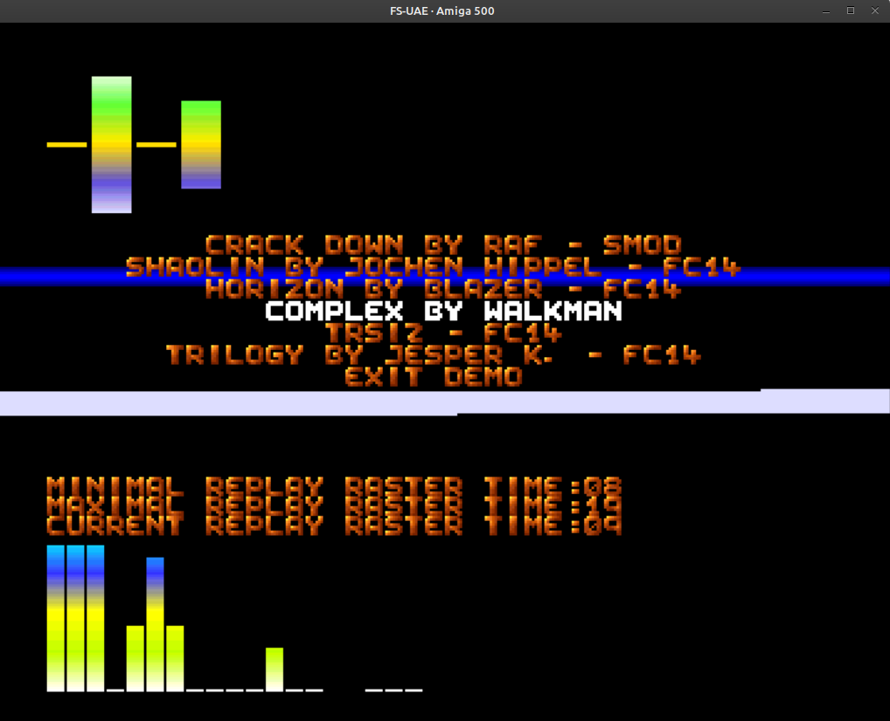

# Amiga Future Composer 1.4 Replay Routine 

_still in progress_

- refactored and fixed (original version doesn't play properly when registers are changed between calls)
- optimized (not much but about 1 raster line is won)
- tested with vasm and asm-two
- playback example using copper interrupt and raster time shown 
- equalizers and music selector included

